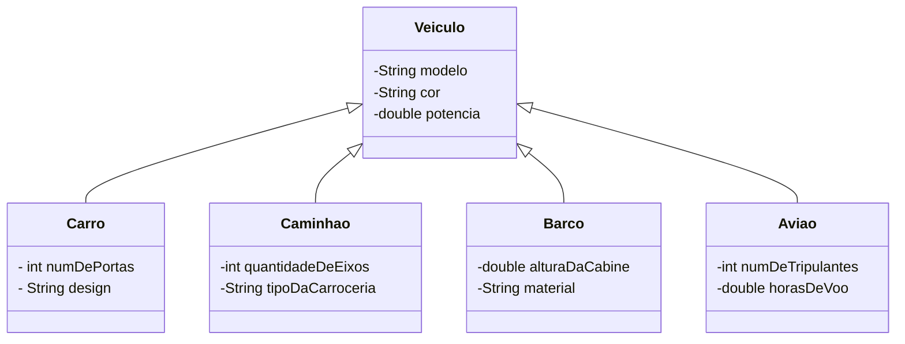

```mermaid
classDiagram
    
 class Veiculo{
     -String modelo
     -String cor
     -double potencia 
}

class Carro{
    - int numDePortas
    - String design
}

class Caminhao{
    -int quantidadeDeEixos
    -String tipoDaCarroceria
}

class Barco{
    -double alturaDaCabine
    -String material
}

class Aviao{
    -int numDeTripulantes
    -double horasDeVoo
}
Veiculo <|-- Carro
Veiculo <|-- Caminhao
Veiculo <|-- Barco
Veiculo <|-- Aviao 
```