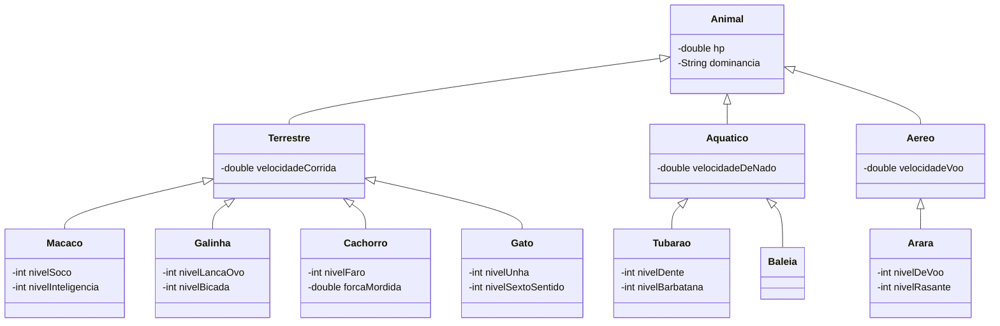

```mermaid

classDiagram
    
class Animal{
    -double hp
    -String dominancia
}    

class Aquatico{
    -double velocidadeDeNado
}

class Terrestre{
    -double velocidadeCorrida
}

class Aereo{
    -double velocidadeVoo
}

class Gato{
    -int nivelUnha
    -int nivelSextoSentido
}

class Baleia{
    
    
}

class Cachorro{
    -int nivelFaro
    -double forcaMordida
}

class Galinha{
    -int nivelLancaOvo
    -int nivelBicada
}

class Macaco{
    -int nivelSoco
    -int nivelInteligencia
}

class Arara{
    -int nivelDeVoo
    -int nivelRasante
}

class Tubarao{
    -int nivelDente
    -int nivelBarbatana
}

Animal <|-- Terrestre
Animal <|-- Aquatico
Animal <|-- Aereo
Aquatico <|-- Tubarao
Aquatico <|-- Baleia
Terrestre <|-- Macaco
Terrestre <|-- Galinha
Terrestre <|-- Cachorro
Terrestre <|-- Gato
Aereo <|-- Arara


```