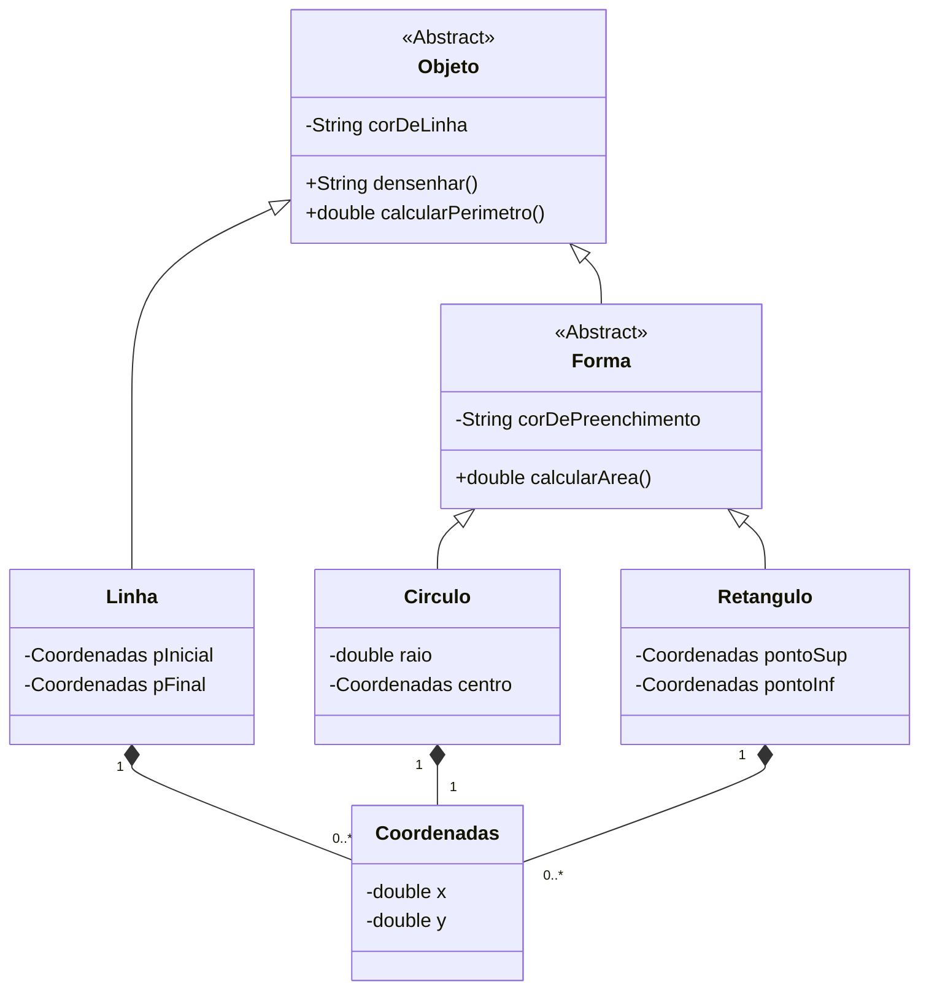

```mermaid
classDiagram

class Objeto{
    <<Abstract>>
    -String corDeLinha
    +String densenhar()
    +double calcularPerimetro()
}

class Forma{
    <<Abstract>>
    -String corDePreenchimento
    +double calcularArea()
} 

class Coordenadas{
    -double x
    -double y
}

class Linha{
    -Coordenadas pInicial
    -Coordenadas pFinal
}

class Circulo{
    -double raio
    -Coordenadas centro
}

class Retangulo{
    -Coordenadas pontoSup
    -Coordenadas pontoInf
}

Objeto <|-- Forma
Objeto <|-- Linha
Forma <|-- Retangulo
Forma <|-- Circulo

Linha "1" *-- "0..*" Coordenadas
Circulo "1" *-- "1" Coordenadas
Retangulo "1" *-- "0..*" Coordenadas


```