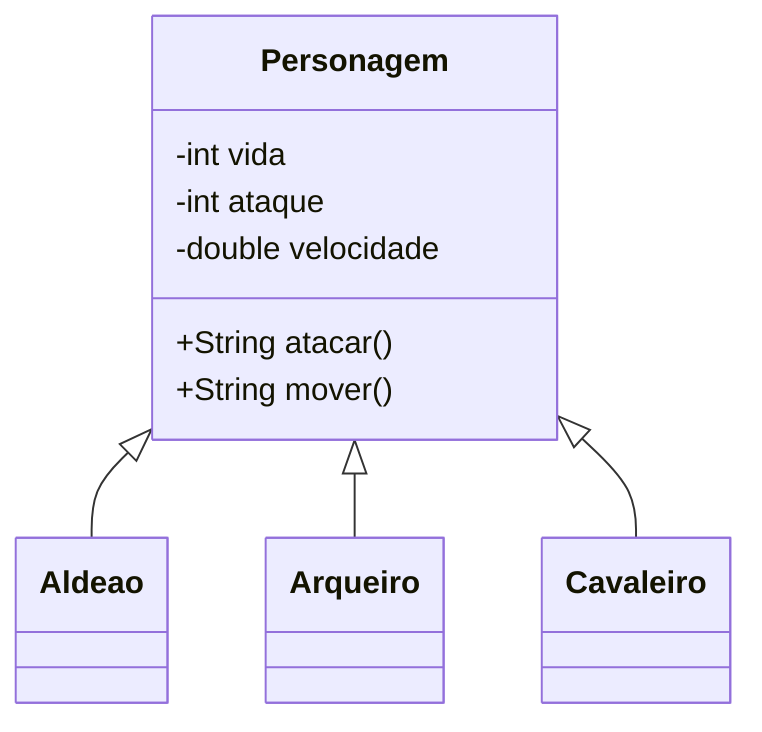

```mermaid

classDiagram
    
class Personagem{
    -int vida
    -int ataque
    -double velocidade
    +String atacar()
    +String mover()
}

class Aldeao{
    
}

class Arqueiro{
    
}

class Cavaleiro{
    
}

Personagem <|-- Aldeao
Personagem <|-- Arqueiro
Personagem <|-- Cavaleiro

```