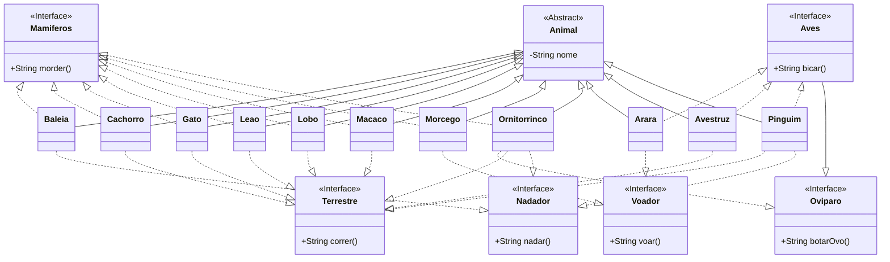

```mermaid
classDiagram
    
class Animal{
    <<Abstract>>
    -String nome
}    

class Mamiferos{
    <<Interface>>
    +String morder()
}

class Aves{
    <<Interface>>
    +String bicar()
}

class Oviparo{
    <<Interface>>
    +String botarOvo()
}

class Voador{
    <<Interface>>
    +String voar()
}

class Terrestre{
    <<Interface>>
    +String correr()
}

class Nadador{
    <<Interface>>
    +String nadar()
}

class Arara{
    
}

class Avestruz{
    
}

class Baleia{
    
}

class Cachorro{
    
}

class Gato{
    
}

class Leao{
    
}

class Lobo{
    
}

class Macaco{
    
}

class Morcego{
    
}

class Pinguim{
    
}

class Ornitorrinco{
    
}

Animal <|-- Baleia
Animal <|-- Cachorro
Animal <|-- Gato
Animal <|-- Leao
Animal <|-- Lobo
Animal <|-- Macaco
Animal <|-- Morcego
Animal <|-- Ornitorrinco
Animal <|-- Arara
Animal <|-- Avestruz
Animal <|-- Pinguim

Mamiferos <|.. Baleia
Mamiferos <|.. Cachorro
Mamiferos <|.. Gato
Mamiferos <|.. Leao
Mamiferos <|.. Lobo
Mamiferos <|.. Macaco
Mamiferos <|.. Morcego
Mamiferos <|.. Ornitorrinco

Aves <|.. Arara
Aves <|.. Avestruz
Aves <|.. Pinguim


Aves --|> Oviparo
Ornitorrinco ..|> Oviparo

Morcego ..|> Voador
Arara ..|> Voador

Cachorro ..|> Terrestre
Gato ..|> Terrestre
Leao ..|> Terrestre
Lobo ..|> Terrestre
Macaco ..|> Terrestre
Pinguim ..|> Terrestre
Avestruz ..|> Terrestre
Ornitorrinco ..|> Terrestre

Baleia ..|> Nadador
Pinguim ..|> Nadador
Ornitorrinco ..|> Nadador


```